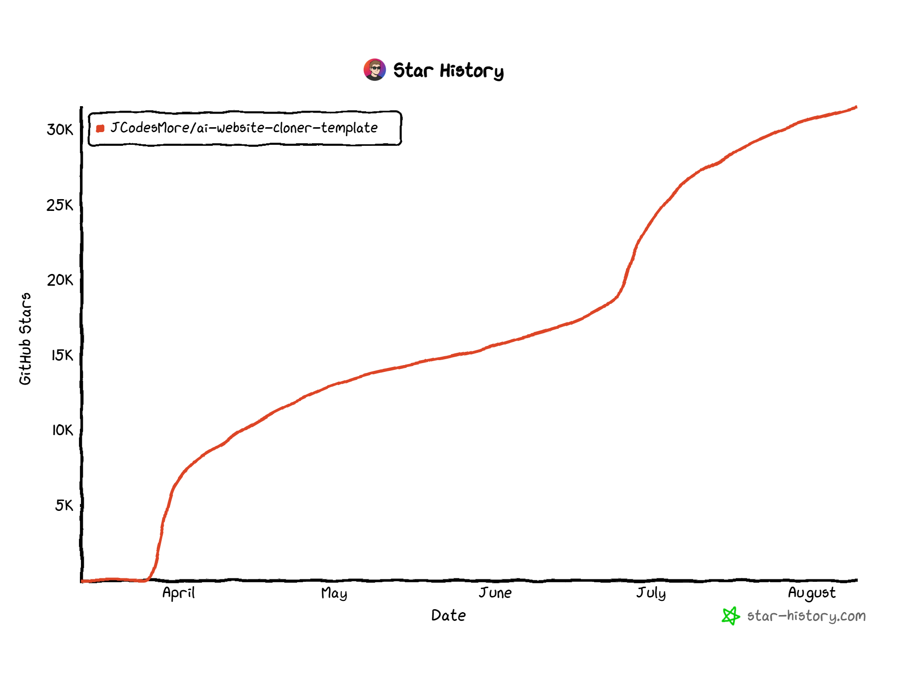

<div align="center">

# AI Website Cloner Template

### Clone any website with one command

Give your AI coding agent a URL and watch it recreate the website as a clean Next.js app.

**Best results with [Claude Code](https://docs.anthropic.com/en/docs/claude-code) + Opus 5. Also supports Codex, Cursor, and OpenCode.**

[](https://github.com/JCodesMore/ai-website-cloner-template/generate) [](https://discord.gg/hrTSX5yTpB)

[Quick Start](#quick-start) · [Watch Demo](#demo) · [Supported Platforms](#supported-platforms)

<a href="https://github.com/JCodesMore/ai-website-cloner-template/blob/master/LICENSE"></a> <a href="https://github.com/JCodesMore/ai-website-cloner-template"></a> 

  <a href="https://trendshift.io/repositories/24302?utm_source=repository-badge&amp;utm_medium=badge&amp;utm_campaign=badge-repository-24302" target="_blank" rel="noopener noreferrer"></a> <a href="https://www.star-history.com/jcodesmore/ai-website-cloner-template/"><picture><source media="(prefers-color-scheme: dark)" srcset="https://api.star-history.com/badge?repo=JCodesMore/ai-website-cloner-template&amp;theme=dark" /><source media="(prefers-color-scheme: light)" srcset="https://api.star-history.com/badge?repo=JCodesMore/ai-website-cloner-template" /></picture></a>

</div>

---

## Demo

[](https://youtu.be/O669pVZ_qr0)

> Click the image above to watch the full demo on YouTube.

## Quick Start

### 1. Set up your project

**Recommended: ask your agent.** Paste this into Codex, Claude Code, or your coding agent:

```text
Set up https://github.com/JCodesMore/ai-website-cloner-template
as a standalone project in a new folder on my computer.
Ask me where to put it. Clone the repository, remove its origin remote,
install dependencies, and run npm run check. Leave it ready for me
to clone a website.
```

**Or create your own GitHub repository:**

[](https://github.com/JCodesMore/ai-website-cloner-template/generate)

Give it a name and click **Create repository**. Then give your agent the new repository's link and ask it to clone it onto your computer, install dependencies, and run `npm run check`.

### 2. Clone a website

Open the project in your agent with browser access enabled. In Claude Code or Cursor, run:

```text
/clone-website https://example.com
```

Replace the URL with the website you want to recreate. Once it's built, ask your agent for any changes you want.

## Supported Platforms

| Agent                                                         | Status                     |
| ------------------------------------------------------------- | -------------------------- |
| [Claude Code](https://docs.anthropic.com/en/docs/claude-code) | **Recommended** — Opus 5   |
| [Codex CLI](https://github.com/openai/codex)                  | Supported                  |
| [OpenCode](https://opencode.ai/)                              | Supported                  |
| [Cursor](https://cursor.com/)                                 | Supported                  |

## Prerequisites

- [Node.js](https://nodejs.org/) 24+
- An AI coding agent (see [Supported Platforms](#supported-platforms))

## Tech Stack

- **Next.js 16** — App Router, React 19, TypeScript strict
- **shadcn/ui** — Radix primitives + Tailwind CSS v4
- **Tailwind CSS v4** — oklch design tokens
- **Lucide React** — default icons (replaced by extracted SVGs during cloning)

## How It Works

The `/clone-website` skill runs a multi-phase pipeline:

1. **Reconnaissance** — screenshots, design token extraction, interaction sweep (scroll, click, hover, responsive)
2. **Foundation** — updates fonts, colors, globals, downloads all assets
3. **Component Specs** — writes detailed spec files (`docs/research/components/`) with exact computed CSS values, states, behaviors, and content
4. **Parallel Build** — dispatches builder agents in git worktrees, one per section/component
5. **Assembly & QA** — merges worktrees, wires up the page, runs visual diff against the original

Each builder agent receives the full component specification inline — exact `getComputedStyle()` values, interaction models, multi-state content, responsive breakpoints, and asset paths. No guessing.

## Use Cases

- **Platform migration** — rebuild a site you own from WordPress/Webflow/Squarespace into a modern Next.js codebase
- **Lost source code** — your site is live but the repo is gone, the developer left, or the stack is legacy. Get the code back in a modern format
- **Learning** — deconstruct how production sites achieve specific layouts, animations, and responsive behavior by working with real code

## Not Intended For

- **Phishing or impersonation** — this project must not be used for deceptive purposes, impersonation, or any activity that breaks the law.
- **Passing off someone's design as your own** — logos, brand assets, and original copy belong to their owners.
- **Violating terms of service** — some sites explicitly prohibit scraping or reproduction. Check first.

## Project Structure

```
src/
  app/              # Next.js routes
  components/       # React components
    ui/             # shadcn/ui primitives
    icons.tsx       # Extracted SVG icons
  lib/utils.ts      # cn() utility
  types/            # TypeScript interfaces
  hooks/            # Custom React hooks
public/
  images/           # Downloaded images from target
  videos/           # Downloaded videos from target
  seo/              # Favicons, OG images
docs/
  research/         # Extraction output & component specs
  design-references/ # Screenshots
.agents/skills/
  clone-website/    # Canonical skill and inspection reference
.claude/commands/
  clone-website.md  # Thin Claude Code bridge
AGENTS.md           # Agent instructions (single source of truth)
CLAUDE.md           # Claude Code config (imports AGENTS.md)
```

## Commands

```bash
npm run dev    # Start dev server
npm run build  # Production build
npm run lint   # ESLint check
npm run typecheck # TypeScript check
npm run check  # Run lint + typecheck + build
```

### If using docker

```bash
docker compose up app --build # build and run the app
docker compose up dev --build # run the app in dev mode on port 3001
```

## Agent Support

The project keeps one portable Agent Skill at `.agents/skills/clone-website/`. Codex, Cursor, and OpenCode read it directly. Claude Code uses the small command bridge at `.claude/commands/clone-website.md` so `/clone-website` and its arguments continue to work without exposing a duplicate skill to the other agents.

Edit the canonical skill directly. There are no generated platform copies or synchronization scripts.


## Star History



## License

MIT
